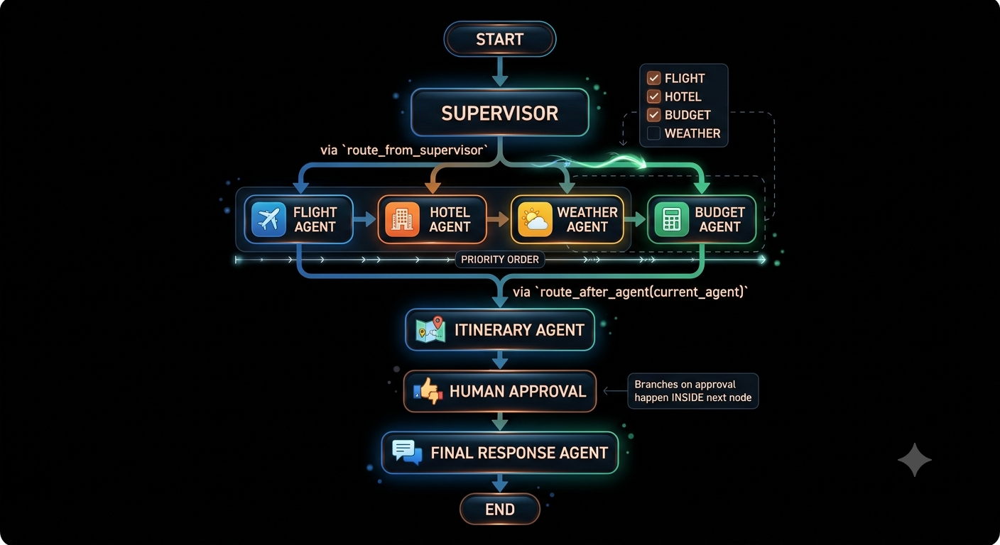

# Real-World Multi-Agent Travel Planner

A LangGraph-based multi-agent system that plans a trip end to end: it interprets a
free-text travel request, associates work to agents (flights, hotels,
weather, budget), drafts an itinerary, pauses for human approval, and then produces
a final plan. Agents get live data through MCP (Model Context Protocol)
servers.


---



---

## 1. How the agent works

1. The user submits a free-text request (e.g. *"Plan a 5-day trip to Tokyo under
   $2500 for two people, include weather info"*)
2. **supervisor_agent** runs an input guardrail (rejects requests which are not related to travel planning.),
   then asks the LLM to extract structured `trip_constraints` (destination, origin,
   duration, budget, etc.) and decide which agents are actually needed to perform these tasks.
3. The graph **dynamically routes** to the selected specialist agents, in a
   fixed order (flight → hotel → weather → budget), skipping the agents which were not selected.
4. Every agent writes its output to the shared state.
   **`itinerary_agent`** always runs last and synthesizes everything (flight,
   hotel, weather, budget results) into a draft itinerary.
5. The graph **pauses** at `human_approval_agent`
   execution stops and the draft itinerary is returned to the caller for review.
6. The user approves or requests changes. The caller resumes the graph with.
7. **`final_response_agent`** produces the polished final plan (incorporating
   feedback if the draft was rejected) and the graph ends.

---

## 2. Agents and their uses

All agents live in [agent.py](agent.py) and are wired into the graph in [graph.py](graph.py).

| Agent | Purpose |
|---|---|
| **`supervisor_agent`** | Entry point. Runs an LLM guardrail to reject non-travel requests, then extracts `trip_constraints` (destination, origin, duration, budget, travel style, preferences) from the free-text query and decides which of the four specialist agents below are needed. |
| **`flight_agent`** | Looks up destination airports and a sample of airlines via the AviationStack MCP server, then asks the LLM to produce flight guidance (likely airports, relevant airlines, fare range, peak-season warning, booking advice). *Note: currently destination-only — see known limitations in CHANGES.md.* |
| **`hotel_agent`** | Uses the Tavily MCP server to web-search for hotel/neighborhood recommendations matching the request and returns the raw search results (no separate LLM summarization step). |
| **`weather_agent`** | Fetches current weather and a forecast for the destination city from the local Weather MCP server (OpenWeather-backed) and returns them as-is. |
| **`budget_agent`** | Given the flight, hotel, and weather results so far, asks the LLM for a feasibility/cost assessment: cost categories, risk areas, money-saving suggestions, and whether the plan fits the stated budget. |
| **`itinerary_agent`** | Synthesizes every specialist agent's output (whichever ran) into a structured, day-by-day draft itinerary, and prepares the approval request shown to the human. Always runs, even if no specialist agents were selected. |
| **`human_approval_agent`** | Pauses the graph with , surfacing the draft itinerary and waiting for a human decision (`approved: bool`, optional `feedback`). Nothing downstream runs until the graph is resumed. |
| **`final_response_agent`** | Produces the final, user-facing travel plan — either polishing the approved draft, or revising it based on the human's rejection feedback. |

---

## 3. MCP servers used

**Why each one is used:**
- **Tavily** — a web search tool. It's used so the hotel agent can search the live web for real hotel and neighborhood recommendations instead of the LLM guessing from memory.
- **AviationStack** — a flight/airport data lookup service. It's used so the flight agent can pull real airport and airline information for the destination instead of making it up.
- **Weather (OpenWeather)** — a weather data service. It's used so the weather agent can tell the traveler what the actual current conditions and forecast look like at their destination.

The `aviationstack` server is a vendored copy of the third-party
[Pradumnasaraf/aviationstack-mcp](https://github.com/Pradumnasaraf/aviationstack-mcp)
project, included in this repo as a **git submodule** (`aviationstack-mcp/`) with
its own `uv`-managed virtual environment. The `weather` server is a small custom
FastMCP server written for this project (`get_current_weather` / `get_forecast`
tools over the OpenWeather API).

---

## 5. State graph explained

Defined in [graph.py](graph.py), built with LangGraph's `StateGraph(TravelState)`.

**State schema** (`state.py`, `TravelState`, a `TypedDict`): holds the running
conversation (`messages`), the user's query and derived `trip_constraints`, the
supervisor's agent selection, each specialist agent's results
(`flight_results`, `hotel_results`, `weather_results`, `budget_results`), the
draft `itinerary`, the human approval fields (`approval_request`,
`human_feedback`, `approved`), and the `final_response`.

**Nodes:** `supervisor`, `flight_agent`, `hotel_agent`, `weather_agent`,
`budget_agent`, `itinerary_agent`, `human_approval`, `final_response` — each
backed by the corresponding function in `agent.py`.

## 6. Running it

### Prerequisites
- A local PostgreSQL server reachable at the address in `DATABASE_URL`, with the
  target database already created (default: `langgraph_memory`).
- A `.env` file in the project root — copy `.env.example` and fill in real values
  for `AVIATION_STACK_API_KEY`, `TAVILY_API_KEY`, `OPENWEATHER_API_KEY`,
  `GROQ_API_KEY` (and/or the Azure OpenAI variables, if using that instead — see
  `config.py`), and `DATABASE_URL`.
- The project venv (`multi_agent/`) with dependencies installed.
- The `aviationstack-mcp` submodule checked out with its own venv set up:
  ```
  git submodule update --init --recursive
  cd aviationstack-mcp
  uv sync
  ```

### Run the app (Streamlit UI)

```
E:\Travelplanneragent\multi_agent\Scripts\streamlit.exe run E:\Travelplanneragent\frontend.py
```

Open the URL Streamlit prints (defaults to `http://localhost:8501`), enter a
travel request, click **Create Draft Plan**, review the draft itinerary, then
approve or request changes to get the final plan.

### Headless backend test (no UI)

```
cd E:\Travelplanneragent
E:\Travelplanneragent\multi_agent\Scripts\python.exe -c "from graph import app; import uuid; r = app.invoke({'user_id':'test','user_query':'Plan a 3-day trip to Paris under $1500'}, config={'configurable':{'thread_id':str(uuid.uuid4())}}); print(list(r.keys()))"
```

This runs the graph up to the human-approval interrupt and prints the resulting
state keys — a quick way to confirm the LLM, all three MCP servers, and the
Postgres checkpointer are all working without going through the UI.
